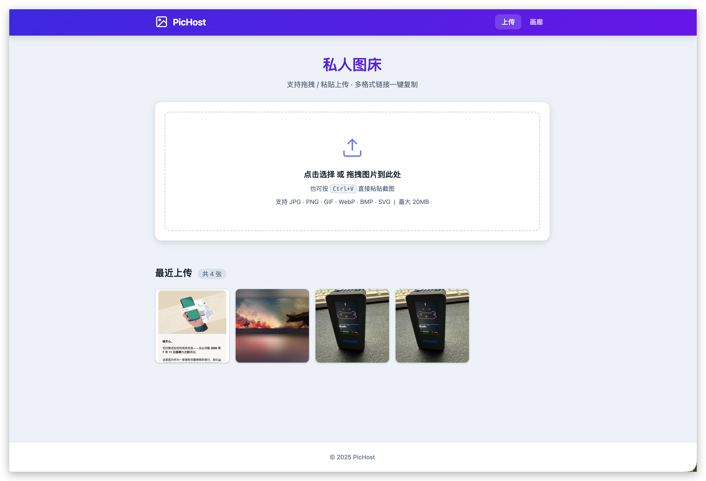

# PicHost

私人图床，基于 FastAPI + 本地存储，支持密钥登录。


## 功能

- 拖拽 / 点击 / Ctrl+V 粘贴上传
- 上传后自动生成直链、BBCode、Markdown、HTML 四种格式，一键复制（.glb 仅直链）
- 自动生成缩略图（400×400）
- 图片画廊，支持大图预览、复制链接、删除
- HEIC 与 MPO（苹果照片，含连拍/景深多帧）自动转为 JPEG 存储，并去除 EXIF 元数据与隐藏帧（GPS/设备信息不外泄）
- HMAC Token 鉴权，密钥保存在本地，Token 有效期 30 天
- 图片直链公开访问，方便外链分享

支持格式：JPG · PNG · GIF · WebP · BMP · SVG（最大 20MB）· HEIC/HEIF（转 JPEG 存储）· GLB 3D 模型（最大 100MB）

## 部署

### 1. 安装依赖

```bash
pip install -r requirements.txt
```

> 升级到支持 HEIC 的版本后,需重新执行 pip install -r requirements.txt 并重启服务。

### 2. 配置密码

```bash
echo "PICHOST_PASSWORD=yourpassword" > .env
chmod 600 .env
```

### 3. 启动

```bash
uvicorn main:app --host 127.0.0.1 --port 8000
```

访问 `http://localhost:8000`，输入密码登录即可使用。

## systemd 服务

```ini
# /etc/systemd/system/pichost.service
[Unit]
Description=PicHost Image Hosting Service
After=network.target

[Service]
User=pichost
Group=pichost
WorkingDirectory=/opt/app/img
ExecStart=/usr/local/bin/uvicorn main:app --host 127.0.0.1 --port 8000
Restart=on-failure
RestartSec=5
# 基础加固
NoNewPrivileges=true
PrivateTmp=true
ProtectSystem=full
ProtectHome=true

[Install]
WantedBy=multi-user.target
```

```bash
systemctl enable --now pichost
```

## Caddy 反代

```
img.example.com {
    reverse_proxy 127.0.0.1:8000
}
```

> 若上传 .glb 大文件,请确认反代的请求体上限 ≥ 100MB(Caddy 默认不限制;Nginx 需 client_max_body_size 100m)。

## 安全建议

- **密码强度**：登录接口未做限流，弱密码可能被在线爆破。请使用足够强的随机密码；如需更稳妥，可在 Caddy 中对 `/api/auth/login` 加 `rate_limit`。
- **用户内容**：`/uploads/*` 由应用以 `Content-Security-Policy: sandbox` + `X-Content-Type-Options: nosniff` 返回，并带 `Cache-Control: immutable` 长缓存——SVG 中的脚本不会执行，图片可永久缓存。
- **上传校验**：服务端按真实字节（Pillow）校验图片类型，不信任客户端声明的 `Content-Type`，非图片内容会被拒绝（HTTP 415）且不落盘。.glb 按 GLB 魔数与版本号校验。HEIC 与 MPO（多帧 JPEG）上传会转码为单帧 JPEG 并去除全部 EXIF 元数据。
- **`.env` 权限**：务必 `chmod 600 .env`，避免同机其他用户读到密码。

## 目录结构

```
.
├── main.py          # FastAPI 后端
├── requirements.txt
├── .env             # 密码（不入库）
├── images.db        # SQLite 元数据（不入库）
├── static/
│   ├── index.html
│   ├── style.css
│   └── app.js
└── uploads/         # 图片存储（不入库）
    └── thumbs/      # 缩略图
```

## API

| 方法 | 路径 | 鉴权 | 说明 |
|------|------|------|------|
| POST | `/api/auth/login` | — | 密码换 Token |
| POST | `/api/upload` | ✓ | 上传图片或 .glb 模型（可指定文件夹） |
| GET | `/api/images` | ✓ | 图片列表（分页 / 按文件夹筛选） |
| DELETE | `/api/images/:id` | ✓ | 删除图片 |
| GET | `/uploads/*` | — | 图片直链 |
| GET | `/api/folders` | ✓ | 文件夹列表（含图片数） |
| POST | `/api/folders` | ✓ | 新建文件夹 |
| PATCH | `/api/folders/:id` | ✓ | 重命名文件夹 |
| DELETE | `/api/folders/:id` | ✓ | 删除文件夹（图片回到未分类） |
| PATCH | `/api/images/:id` | ✓ | 移动图片到文件夹 |
